# (16) Basic Simple C Programs

### 1. C Program to Display The Size of Different Data Types

| Data Type   | Size (bytes) | Range                           | Format Specifier |
| ----------- | ------------ | ------------------------------- | ---------------- |
| int         | 4            | -2,147,483,648 to 2,147,483,647 | %d               |
| long int    | 4            | -2,147,483,648 to 2,147,483,647 | %ld              |
| float       | 4            | 1.2E-38 to 3.4E+38              | %f               |
| double      | 8            | 1.7E-308 to 1.7E+308            | %lf              |
| long double | 16           | 3.4E-4932 to 1.1E+4932          | %Lf              |
| char        | 1            | -128 to 127                     | %c               |

[Click Here For Solution](question_1.c)

### 2. Write a program to accept values of two numbers and print their addition, subtraction, multiplication, division.

**Addition:** x + y;

**Subtraction:** x - y;

**multiplication:** x \* y;

**division:** x / y;

[Click Here For Solution](question_2.c)

### 3. Write a program to accept a number from user and print it’s square & cube in C language

**Square:** x \* x

**Cube:** x \* x \* x

[Click Here For Solution](question_3.c)

### 4. Write a program to accept two values a & b and interchange their values in C language

**Before Interchange value:** a = 12; b = 15

**After Interchange value:** a = 15; b = 12

[Click Here For Solution](question_4.c)

### 5. Write a program to accept roll no & marks of 3 subjects of a student, Calculate total 3 subjects and average in c language

**Average:** Snaskrit + Hindi + Math / 3

[Click Here For Solution](question_5.c)

### 6. Print following outputs: http:\\www.kodegod.com\new in C language

[Click Here For Solution](question_6.c)

### 7. Area and Circumference of a Circle

**Area of the Circle is:** π \* r \* r

**Circumstances of the Circle are:** 2 \* π \* r

[Click Here For Solution](question_7.c)

### 8. Print Ascii Value of the Character

[Click Here For Solution](question_8.c)

### 9. Write a program to print area of a triangle

**Triangle =** 0.5 \* Base \* Height

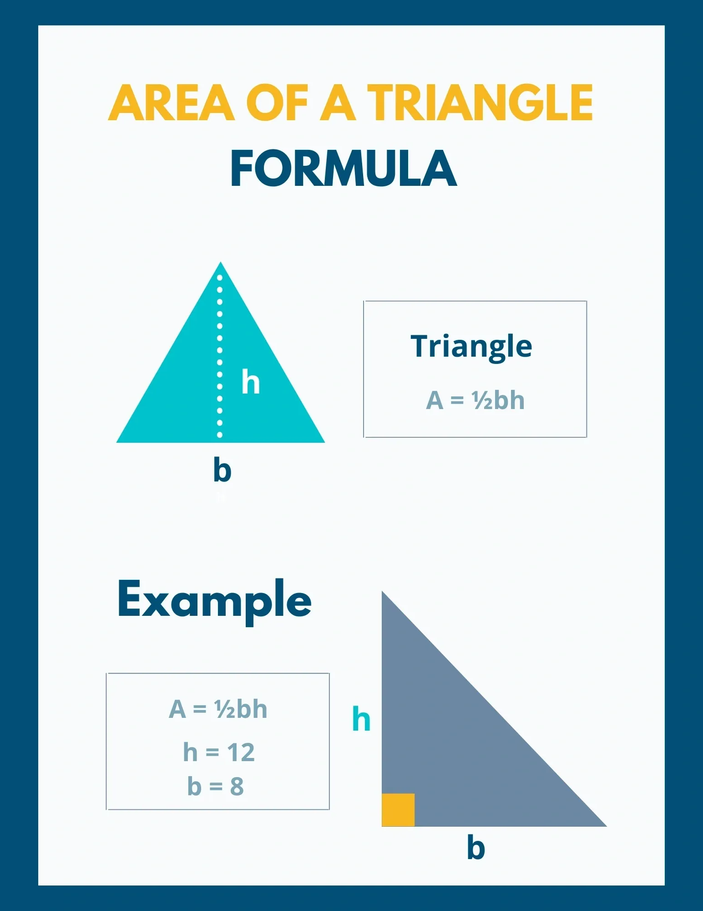

[Click Here For Solution](question_9.c)

### 10. Convert a Person’s Name in Abbreviated

**Name:** Ghanendra Pratap Singh

**Abbreviated Name:** G. P. Singh

[Click Here For Solution](question_10.c)

### 11. C Program For Calculate Simple Interest

**Simple Interest** = ( Principal Amount \* Rate of Interest \* Time ) / 100;

[Click Here For Solution](question_11.c)

### 12. Write a program to accept a name and basic salary of an employee calculate and display the gross salary Program in C.

**Gross Salary** = Basic_Salary + HRA + Other_Allowance.

[Click Here For Solution](question_12.c)

### 13. Calculate Percentage of 5 Subjects

**percentage =** ((sanskrit + hindi + math + english + accountancy) / 500) \* 100

[Click Here For Solution](question_13.c)

### 14. C Program For Converting Temperature Celsius Into Fahrenheit

**Fahrenheit =**((9/5) \* Celsius) + 32; or you can use 1.8 in place of 9/5

[Click Here For Solution](question_14.c)

### 15. First Three Powers (N, N \* N, N \* N \* N) Without Using Power Function

**Three Powers:** (N, N \* N, N \* N \* N)

[Click Here For Solution](question_15.c)

# (12) If/Else Statement

### 17. Write a program to accept a number and print if the number is Positive/Negative in C language

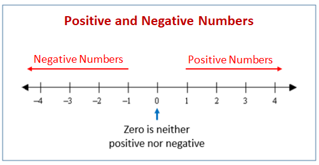

[Click Here For Solution](question_17.c)

### 18. Write a program to accept a number from user and print if it is even or odd in C language

**HINT: Even number is divisible by 2 and generates a remainder of 0**

[Click Here For Solution](question_18.c)

### 19. Write a program to accept two numbers from user and compare them in C language

[Click Here For Solution](question_19.c)

### 20. Write a program to accept three numbers from user and print them in ascending and descending order in C language

[Click Here For Solution](question_20.c)

### 21. Write a program to calculate roots of a quadratic equations in C language

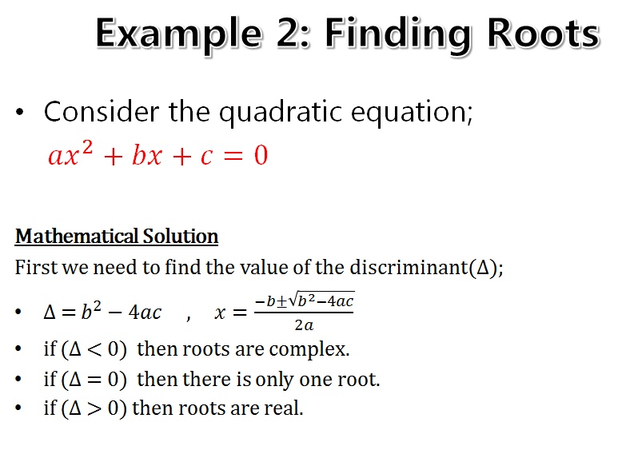

[Click Here For Solution](question_21.c)

### 22. Write a program to accept roll number ,and marks for three subjects, print total marks and average, also print grade by considering following conditions

**Avg>=60** Grade A

**Avg<60, Avg>=50** Grade B

**Avg<50, Avg>=40** Grade C Grade F.

[Click Here For Solution](question_22.c)

### 23. Write a Program to accept user’s marital status, gender and age to check if he/she is eligible for marriage or not.

[Click Here For Solution](question_23.c)

### 24. Check Character Is Vowel or Consonant

[Click Here For Solution](question_24.c)

### 25. A Character Is an Alphabet or Not

[Click Here For Solution](question_25.c)

### 26. C Program to Check Uppercase or Lowercase or Digit or Special Character

**Hint:** [ASCII](https://www.cs.cmu.edu/~pattis/15-1XX/common/handouts/ascii.html) value of the digit is between 48 to 58 and lowercase characters have ASCII values in the range of 97 to122, and uppercase is between 65 and 90.

[Click Here For Solution](question_26.c)

## 27. Leap Year Program in C Using IF-ELSE

**Leap Year Examples:**

- 1992: Leap Year
- 2002: Not a Leap Year
- 2016: Leap Year
- 2100: Not a Leap Year

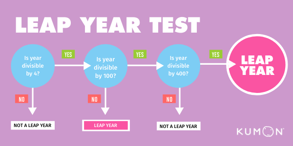

[Click Here For Solution](question27.c)

### 28. Given Date Month and the Year Is Correct or Not Using If-Else

**Valid Date Examples:**

- 09-03-2002
- 01-01-2023
- 31-12-2025

**Invalid Date Examples:**

- 29-02-2023
- 32-12-2023
- 31-03-2023

[Click Here For Solution](question_28.c)

# Loops C Programs

### 29. C Program to Reverse a Number Using FOR Loop

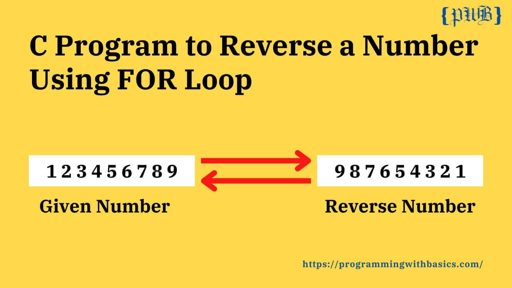

[Click Here For Solution](question_29.c)

### 30. Write a c program to check whether a given number is an Armstrong number or not.

**Example: 153 is an Armstrong number**

153 = (1 \* 1 \*1) + (5 \* 5 \* 5) + (3 \* 3 \* 3)

where:  
(1 \* 1 \* 1)=1  
(5 \* 5 \* 5)=125  
(3 \*3 \* 3)=27

So:  
1 + 125 + 27 = 153

153 is an Armstrong number

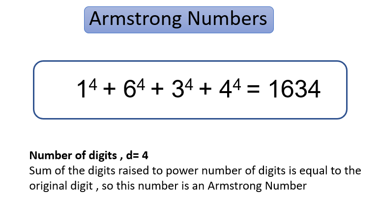

[Click Here For Solution](question_30.c)

### 31. Calculate the Sum of n Natural Numbers Using the While Loop

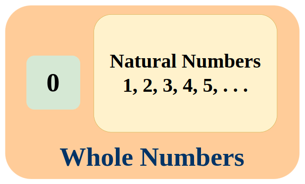

[Click Here For Solution](question_31.c)

### 32. Write a C Program to Print the Multiplication Table of N

[Click Here For Solution](question_32.c)

### 33. Fibonacci Series Program in C Using DO While Loop

**Fibonacci Series:** 0, 1, 1, 2, 3, 5, 8, 13, 21, 34. Fibonacci Series is up to 10 Elements.

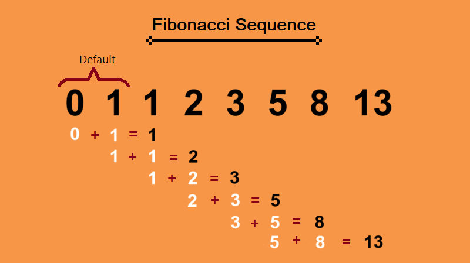

[Click Here For Solution](question_33.c)

### 34. GCD of Two Numbers in C | Greatest Common Divisor Program

[Click Here For Solution](question_34.c)

### 35. Program to Find LCM of Two Numbers in C Using While Loop

**Formula**

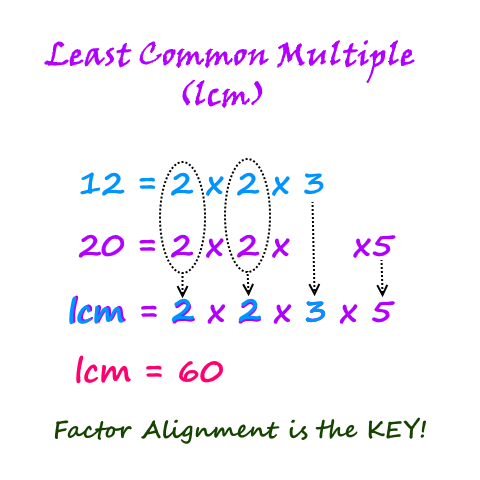

[Click Here For Solution](question_35.c)

### 36. Palindrome Program in C Using While Loop

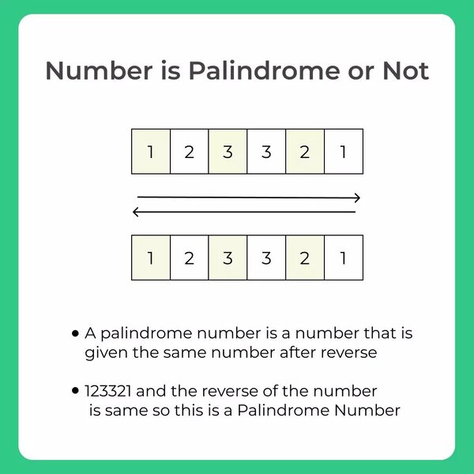

[Click Here For Solution](question_36.c)

### 37. Count the Number of Digits of an Integer Using the While Loop

[Click Here For Solution](question_37.c)

### 38. Find a Generic Root of a Number Using While Loop

**For Example:** If user input number is 12345, then we add all the individual digits of the number i.e., 1 + 2 + 3 + 4 + 5 = 15. We got 15. Now we add individual digits of number 15 i.e., 1 + 5 = 6. So Generic Root of number 12345 is 6.

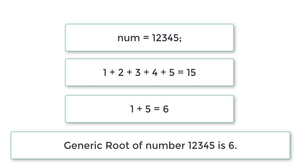

[Click Here For Solution](question_38.c)

### 39. C Program to Print The Calendar of a Month of 31 Days

**Output**

    Enter Total Numbers of Days in a Month:31

    Enter 0 for Monday:
    Enter 1 for Tuesday:
    Enter 2 for Wednesday:
    Enter 3 for Thursday:
    Enter 4 for Friday:
    Enter 5 for Saturday:
    Enter 6 for Sunday:

    Enter First Day of the month 0 to 6:5

    Mon     Tue     Wed     Thu     Fri     Sat     Sun
    _________________________________________________
    -       -       -       -       -       1       2
    3       4       5       6       7       8       9
    10      11      12      13      14      15      16
    17      18      19      20      21      22      23
    24      25      26      27      28      29      30
    31

[Click Here For Solution](question_39.c)

### 40. Check Whether a Number Is Divisible by 11 Using (Vedic Maths)

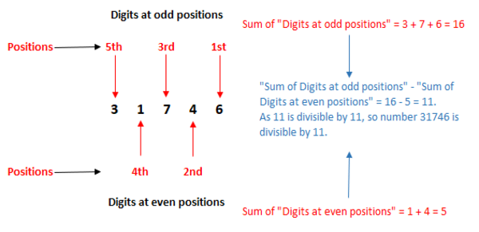

[Click Here For Solution](question_40.c)

### 41. Denomination of an Amount Using While Loop

    Logic :- The Logic Behind we have to divide a money by Above Money lets take a example Suppose money is 16108 then follow the Step We are taking a example of Indian Currency In present

    Step 1:- Then First we divide 16108  by 2000 then we get 8    ,2000 rs notes then go to step 2

    Step 2:-  After divide 2000 we get a remainder 108 The we know that 108 is not divisible by 500 so go to next step

    Step 3:- Now divide 108 by 100 then we get 1 ,100 rs note now remainder is 8 go to next step

    Step 4:- 8 is divisible by 50 and 20 nor 10 so we escape now go to next step

    Step 5:- Now divide 8 by 5 we get a 1 ,5 rs notes and remainder is 3 so go to next step

    Step 6:- Now divide 3 by 2 we get 1 ,2 rs notes and remainder is 1
    so follow the next step

    Step 7:- This is a Last step divide 1 by 1 we get zero remainder now print the total no of denomination needed and along with total no of count require to fulfill a requirement

    So for 16108 You Need to

    No.

    8 * 2000 = 16000
    1 * 100 = 100
    1 * 5 = 5
    1 * 2 = 2
    1 * 1 = 1

    Total =12 Notes For minimum Transaction

[Click Here For Solution](question_41.c)

### 42. Write a Program to print numbers 1 to n using while loop in C language

[Click Here For Solution](question_42.c)

### 43. Write a Program to print first n even numbers in C language

**HINT: Even number is divisible by 2 and generates a remainder of 0**

[Click Here For Solution](question_43.c)

### 44. Write a Program to print first n odd numbers in C language

**HINT: Odd number is divisible by 2 and generates a remainder of 1**

[Click Here For Solution](question_44.c)

### 45. Write A Program To Accept A Number From User And Print If It Is Prime Or Not In C Language

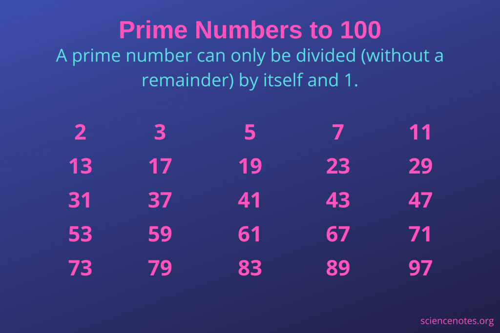

[Click Here For Solution](question_45.c)

### 46. Write a Program to accept a number and print sum of it’s digits in C language

**Ex: 153 Sum of its digit is 9**

[Click Here For Solution](question_46.c)

### 47. Write A Program To Accept A Number From User And Print It’s Factorial In C Language

**factorial of 5 is:** 5! = 5 x 4 x 3 x 2 x 1 = 120

[Click Here For Solution](question_47.c)

### 48. Write a program to accept a number and print prime numbers between 2 and n in C language

[Click Here For Solution](question_48.c)

### 49. Write a program to print digits, alphabets in capital and lower case in C language

**[ASCII](https://www.cs.cmu.edu/~pattis/15-1XX/common/handouts/ascii.html)**

    Digits

    0  1  2  3  4  5  6  7  8  9

    Uppercase Alphabets

    A  B  C  D  E  F  G  H  I  J  K  L  M  N  O  P  Q  R  S  T  U  V  W  X  Y  Z

    Lowercase Alphabets

    a  b  c  d  e  f  g  h  i  j  k  l  m  n  o  p  q  r  s  t  u  v  w  x  y  z

[Click Here For Solution](question_49.c)

### 50. Write a program to print out ASCII chart on a single screen (all 256 characters from 0 to 255) in a tabular form. The ASCII code should be followed by the corresponding character in C language

**[ASCII](https://www.cs.cmu.edu/~pattis/15-1XX/common/handouts/ascii.html)**

[Click Here For Solution](question_50.c)

### 51. Program To Print Triangular Number Series Till n

**Triangular Number Example:** 15 is Triangular Number because it can be obtained by 1+2+3+4+5+6 i.e. 1+2+3+4+5+6=15

**List of Triangular Numbers:** 1, 3, 6, 10, 15, 21, 28, 36, 45, 55, 66, 78, 91, 105, 120, 136, 153, 171, 190, 210, 231, 253, 276, 300, 325, 351, 378, 406, 435, 465, 496, 528, 561, 595, 630, 666,

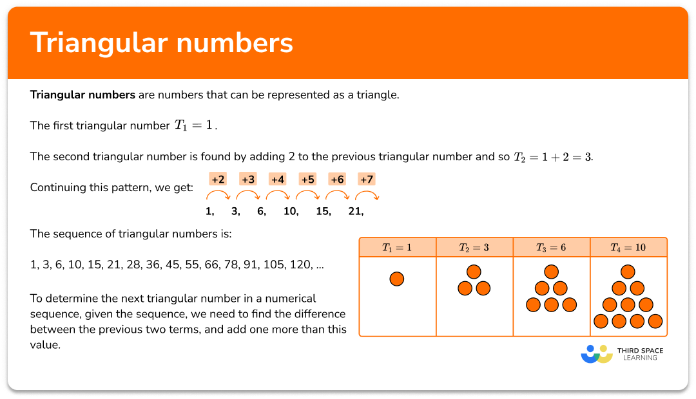

[Click Here For Solution](question_51.c)

### 52. C Program to Check Whether a Number is Triangular or Not

**Triangular Number Example:** 15 is Triangular Number because it can be obtained by 1+2+3+4+5+6 i.e. 1+2+3+4+5+6=15

**List of Triangular Numbers:** 1, 3, 6, 10, 15, 21, 28, 36, 45, 55, 66, 78, 91, 105, 120, 136, 153, 171, 190, 210, 231, 253, 276, 300, 325, 351, 378, 406, 435, 465, 496, 528, 561, 595, 630, 666,

[Click Here For Solution](question_52.c)

### .

**Formula**

[Click Here For Solution](.c)

### .

**Formula**

[Click Here For Solution](.c)

### .

**Formula**

[Click Here For Solution](.c)

### .

**Formula**

[Click Here For Solution](.c)

### .

**Formula**

[Click Here For Solution](.c)

### .

**Formula**

[Click Here For Solution](.c)

### .

**Formula**

[Click Here For Solution](.c)

### .

**Formula**

[Click Here For Solution](.c)

### .

**Formula**

[Click Here For Solution](.c)

### .

**Formula**

[Click Here For Solution](.c)

### .

**Formula**

[Click Here For Solution](.c)

### .

**Formula**

[Click Here For Solution](.c)

### .

**Formula**

[Click Here For Solution](.c)
