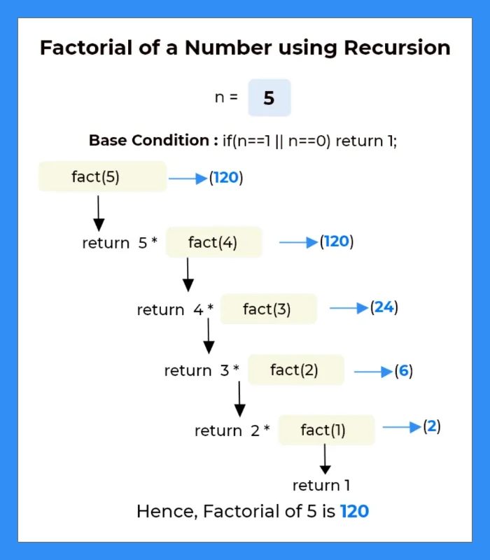

# (16) Basic Simple C Programs

### 1. C Program to Display The Size of Different Data Types

| Data Type   | Size (bytes) | Range                           | Format Specifier |
| ----------- | ------------ | ------------------------------- | ---------------- |
| int         | 4            | -2,147,483,648 to 2,147,483,647 | %d               |
| long int    | 4            | -2,147,483,648 to 2,147,483,647 | %ld              |
| float       | 4            | 1.2E-38 to 3.4E+38              | %f               |
| double      | 8            | 1.7E-308 to 1.7E+308            | %lf              |
| long double | 16           | 3.4E-4932 to 1.1E+4932          | %Lf              |
| char        | 1            | -128 to 127                     | %c               |

[Click Here For Solution](question_1.c)

### 2. Write a program to accept values of two numbers and print their addition, subtraction, multiplication, division.

**Addition:** x + y;

**Subtraction:** x - y;

**multiplication:** x \* y;

**division:** x / y;

[Click Here For Solution](question_2.c)

### 3. Write a program to accept a number from user and print it’s square & cube in C language

**Square:** x \* x

**Cube:** x \* x \* x

[Click Here For Solution](question_3.c)

### 4. Write a program to accept two values a & b and interchange their values in C language

**Before Interchange value:** a = 12; b = 15

**After Interchange value:** a = 15; b = 12

[Click Here For Solution](question_4.c)

### 5. Write a program to accept roll no & marks of 3 subjects of a student, Calculate total 3 subjects and average in c language

**Average:** Snaskrit + Hindi + Math / 3

[Click Here For Solution](question_5.c)

### 6. Print following outputs: http:\\www.kodegod.com\new in C language

[Click Here For Solution](question_6.c)

### 7. Area and Circumference of a Circle

**Area of the Circle is:** π \* r \* r

**Circumstances of the Circle are:** 2 \* π \* r

[Click Here For Solution](question_7.c)

### 8. Print Ascii Value of the Character

[Click Here For Solution](question_8.c)

### 9. Write a program to print area of a triangle

**Triangle =** 0.5 \* Base \* Height

[Click Here For Solution](question_9.c)

### 10. Convert a Person’s Name in Abbreviated

**Name:** Ghanendra Pratap Singh

**Abbreviated Name:** G. P. Singh

[Click Here For Solution](question_10.c)

### 11. C Program For Calculate Simple Interest

**Simple Interest** = ( Principal Amount \* Rate of Interest \* Time ) / 100;

[Click Here For Solution](question_11.c)

### 12. Write a program to accept a name and basic salary of an employee calculate and display the gross salary Program in C.

**Gross Salary** = Basic_Salary + HRA + Other_Allowance.

[Click Here For Solution](question_12.c)

### 13. Calculate Percentage of 5 Subjects

**percentage =** ((sanskrit + hindi + math + english + accountancy) / 500) \* 100

[Click Here For Solution](question_13.c)

### 14. C Program For Converting Temperature Celsius Into Fahrenheit

**Fahrenheit =**((9/5) \* Celsius) + 32; or you can use 1.8 in place of 9/5

[Click Here For Solution](question_14.c)

### 15. First Three Powers (N, N \* N, N \* N \* N) Without Using Power Function

**Three Powers:** (N, N \* N, N \* N \* N)

[Click Here For Solution](question_16.c)

<!-- ## 15. Write A Program To Accept A Number From User And Print It’s Factorial In C Language

**factorial of 5 is:** 5! = 5 x 4 x 3 x 2 x 1 = 120

[Click Here For Solution](question_15.c) -->

# (12) If/Else Statement

### 17. Write a program to accept a number and print if the number is Positive/Negative in C language

[Click Here For Solution](question_17.c)

### 18. Write a program to accept a number from user and print if it is even or odd in C language

**Even number is divisible by 2 and generates a remainder of 0**

[Click Here For Solution](question_18.c)

### 19. Write a program to accept two numbers from user and compare them in C language

[Click Here For Solution](question_19.c)

## 20. Write a program to accept three numbers from user and print them in ascending and descending order in C language

[Click Here For Solution](question_20.c)

### 21. Write a program to calculate roots of a quadratic equations in C language

[Click Here For Solution](question_21.c)

### 22. Write a program to accept roll number ,and marks for three subjects, print total marks and average, also print grade by considering following conditions

**Avg>=60** Grade A

**Avg<60, Avg>=50** Grade B

**Avg<50, Avg>=40** Grade C Grade F.

[Click Here For Solution](question_22.c)

### 23. Write a Program to accept user’s marital status, gender and age to check if he/she is eligible for marriage or not.

[Click Here For Solution](question_23.c)

### 24. Check Character Is Vowel or Consonant

[Click Here For Solution](question_24.c)

### 25. A Character Is an Alphabet or Not

[Click Here For Solution](question_25.c)

### 26. C Program to Check Uppercase or Lowercase or Digit or Special Character

**Hint:** [ASCII](https://www.cs.cmu.edu/~pattis/15-1XX/common/handouts/ascii.html) value of the digit is between 48 to 58 and lowercase characters have ASCII values in the range of 97 to122, and uppercase is between 65 and 90.

[Click Here For Solution](question_26.c)

## 27. Leap Year Program in C Using IF-ELSE

**Leap Year Examples:**

- 1992: Leap Year
- 2002: Not a Leap Year
- 2016: Leap Year
- 2100: Not a Leap Year

[Click Here For Solution](question27.c)

### 28. Given Date Month and the Year Is Correct or Not Using If-Else

**Valid Date Examples:**

- 09-03-2002
- 01-01-2023
- 31-12-2025

**Invalid Date Examples:**

- 29-02-2023
- 32-12-2023
- 31-03-2023

[Click Here For Solution](question_28.c)

# Loops C Programs

### 29.

[Click Here For Solution](question_29.c)

###

**Formula**

[Click Here For Solution](.c)

###

**Formula**

[Click Here For Solution](.c)

###

**Formula**

[Click Here For Solution](.c)

###

**Formula**

[Click Here For Solution](.c)

###

**Formula**

[Click Here For Solution](.c)

###

**Formula**

[Click Here For Solution](.c)

###

**Formula**

[Click Here For Solution](.c)

###

**Formula**

[Click Here For Solution](.c)

###

**Formula**

[Click Here For Solution](.c)

###

**Formula**

[Click Here For Solution](.c)
